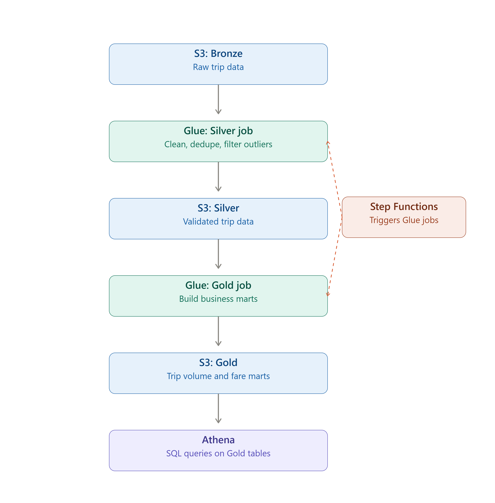

# System Design: NYC TLC Data Platform — Track A (AWS-Native)

## 1. Context
This system turns raw, messy NYC TLC trip data into clean, queryable business insights. 
It’s designed for two main audiences: data analysts who will run Athena queries on the Gold-layer marts, and hiring managers evaluating the architecture as part of a technical assessment.

## 2. Architecture Overview
The platform follows a Bronze → Silver → Gold flow:
- Raw trip data lands in an S3 Bronze bucket.
- A Glue job transforms and cleans the data, writing the result to an S3 Silver bucket.
- A second Glue job builds business-ready marts from the Silver data and writes them to an S3 Gold bucket.
- Athena queries the Gold-layer tables for reporting and analysis.
- Step Functions orchestrates the two Glue jobs, ensuring Gold only runs if Silver succeeds.

## 3. Components

### Storage (S3)
- Bronze bucket: Holds the raw TLC trip files as received. It is versioned to protect against accidental overwrites or deletions, and public access is blocked for security.
- Silver bucket: Stores the cleaned and validated data after the Silver transformation. It follows the same versioning and access controls as Bronze.
- Gold bucket: Not yet built. This will hold the final business marts once deployed.

### Compute (AWS Glue)
- Glue was chosen as the compute engine for Track A (see ADR-0002 for details).
- The Silver job enforces schema, filters out outliers (such as the 2007 timestamp found in March 2025 data), removes duplicates, and writes cleaned data to Silver.
- The Gold job (validated locally, not yet deployed as a Glue job) reads Silver data and the TLC zone lookup table to build two marts: daily trip volume by borough, and daily average fare and tip amounts.

### Cataloging (Glue Data Catalog + Athena)
- The Glue Data Catalog holds table definitions for Silver and Gold layers, making the data discoverable and queryable.
- Athena is intended to query the Gold-layer tables. The Data Catalog database exists, but end-to-end Athena access is pending full Glue job deployment.

### Orchestration (Step Functions)
- The Step Functions state machine (tlc-silver-gold-pipeline) runs the Silver Glue job first. If it succeeds, it triggers the Gold Glue job.
- If Silver fails, the workflow retries twice with exponential backoff (30s, then 60s). If it still fails, the workflow stops before attempting Gold, preventing downstream jobs from running on incomplete data.
- The state machine is deployed, but full end-to-end execution is currently blocked due to an AWS account-level access issue (see PR notes).

### IAM
- The Glue job role has least-privilege permissions scoped to the specific S3 buckets and Glue actions needed.
- The human user currently operates with broad AdministratorAccess for setup and troubleshooting. A full security review and tightening of IAM policies is planned for Phase 4.

## 4. Data Flow (step by step)
Here’s what happens to a single month of data, from start to finish:

1.	A raw TLC trip file lands in the Bronze S3 bucket.
2.	The Silver Glue job reads the file, enforces the schema, filters out outliers (such as the 2007 timestamp), and removes duplicates.
3.	The cleaned data is written to the Silver S3 bucket.
4.	The Gold Glue job reads the Silver data along with the TLC zone lookup table.
5.	It builds two business marts: daily trip volume by pickup borough, and daily average fare and tip amounts (excluding payment_type = 0 trips).
6.	The marts are written to the Gold S3 bucket.
7.	The data becomes queryable in Athena for reporting and analysis.

## 5. Failure Modes and Handling
The design follows a “fail loud and early” philosophy:
•	Silver job fails mid-run: Step Functions retries twice with exponential backoff. If it still fails, the workflow stops before Gold runs, preventing downstream jobs from using incomplete data.
•	Bad timestamps in a month’s data: These are filtered out during the Silver transformation (e.g., the 2007 outlier found in March 2025 data).
•	Trips with no borough match: These appear as “N/A” or “Unknown” in the Gold layer instead of being silently dropped, preserving data transparency.

## 6. Known Limitations and Open Items
•  Only three months of data (January–March 2025) have been processed so far, not the full 24–36 month range.
•  The Gold layer has been validated locally but is not yet deployed as an actual Glue job.
•  AWS Glue and Cost Explorer access are currently blocked pending resolution of an AWS Support case.
•  IAM roles for the human user currently use broad AdministratorAccess. The Glue job role is reasonably scoped but has not yet undergone a full security review — this is planned for Phase 4.
•  No automated data quality checks are in place yet — these are planned for Phase 2.

## 7. What This Design Would Look Like at Full Scale
At full scale (24–36 months across three trip types), the same architecture would apply, but with adjustments:
•	Glue worker counts and job concurrency would likely need to increase to handle the larger data volume.
•	Partitioning strategies (by year, month, and trip type) would become more important to keep query performance and costs manageable.
•	Additional monitoring and alerting would be needed to catch pipeline issues early across a much larger dataset.
These changes don’t need to be built yet, but they’ve been considered as part of the design.

